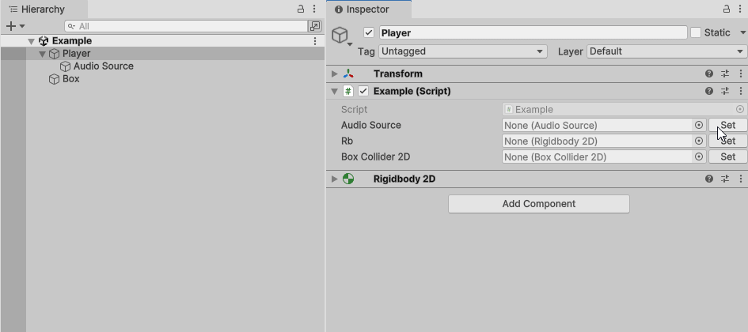
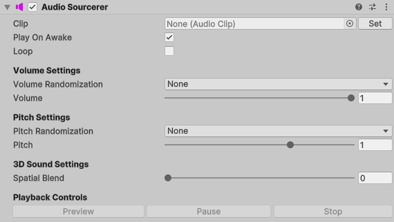

# Improved Unity Components

Reusable, self‑contained components that build on existing Unity components.

### Editor Tools
- [AutoComponentSelector](#autocomponentselector)
### Components
- [AudioSourcerer](#audiosourcerer)

---

# Editor Tools

### AutoComponentSelector🔎
Adds a button to the right of every field referencing any script or component that derives from [Object](https://docs.unity3d.com/Manual/class-Object.html). When pressed, it automatically tries to assign the object by searching on the GameObject, it's Children, Parents and scene.

# Components

### AudioSourcerer🔉
An [AudioSource](https://docs.unity3d.com/6000.2/Documentation/Manual/class-AudioSource.html) wrapper that adds extra functionality like randomizable volume and pitch, editor-runtime preview and basic [DOTween](https://dotween.demigiant.com/) extensions.

