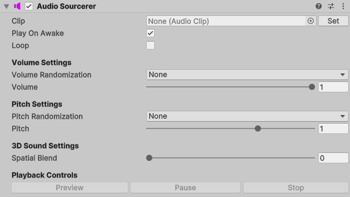

# Improved Unity Components

Reusable, self‑contained components that build on existing Unity components.

## Table of Contents
- [AudioSourcerer](#audiosourcerer)
<!-- - [BetterButton](#betterbutton) -->

## AudioSourcerer🔉
An [AudioSource](https://docs.unity3d.com/6000.2/Documentation/Manual/class-AudioSource.html) wrapper that adds extra functionality like randomizable volume and pitch, editor-runtime preview and basic [DOTween](https://dotween.demigiant.com/) extensions.

<!-- ## BetterButton🛑
An [AudioSource](https://docs.unity3d.com/6000.2/Documentation/Manual/class-AudioSource.html) wrapper that adds extra functionality like randomizable volume and pitch, editor-runtime preview and basic [DOTween](https://dotween.demigiant.com/) extensions.

 -->
